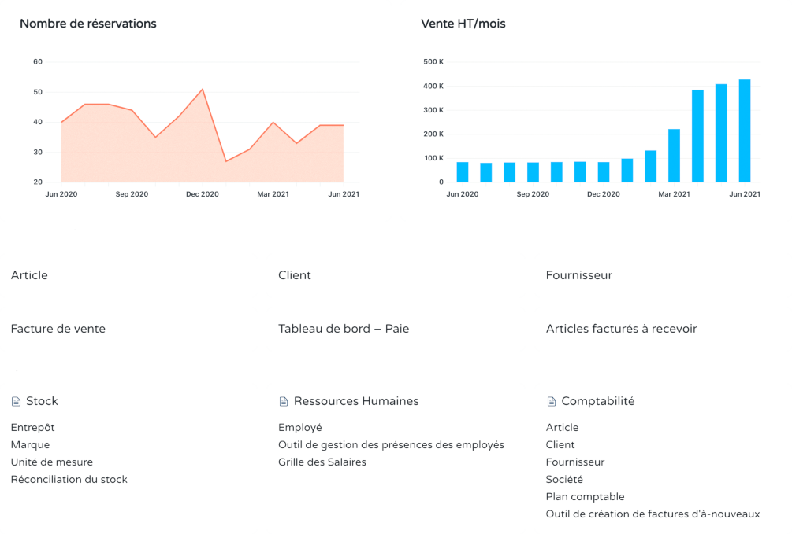

<!--
Ohart ongi: README hau automatikoki sortu da <https://github.com/YunoHost/apps/tree/master/tools/readme_generator>ri esker
EZ editatu eskuz.
-->

# Dokos YunoHost-erako

[](https://ci-apps.yunohost.org/ci/apps/dokos/)  

[](https://install-app.yunohost.org/?app=dokos)

*[Irakurri README hau beste hizkuntzatan.](./ALL_README.md)*

> *Pakete honek Dokos YunoHost zerbitzari batean azkar eta zailtasunik gabe instalatzea ahalbidetzen dizu.*  
> *YunoHost ez baduzu, kontsultatu [gida](https://yunohost.org/install) nola instalatu ikasteko.*

## Aurreikuspena

Open-source business management software based on ERPNext, and powered by the highly customizable low-code framework Dodock/Frappe.

Many features are available, such as accounting, billing, CRM, e-commerce, manufacturing, project management, Third-Places management, and so much more.

**Session cookies conflict**
This Dokos package should not be installed on a Yunohost subdomain: 
Yunohost on `yunohost.domain.tld` and Dokos on `dokos.domain.tld` works fine!
Yunohost on `yunohost.domain.tld` and Dokos on `dokos.yunohost.domain.tld` will create conflicts between Yunohost and Dokos session cookies.


**Paketatutako bertsioa:** 4.33.0~ynh1

## Pantaila-argazkiak



## Dokumentazioa eta baliabideak

- Aplikazioaren webgune ofiziala: <https://dokos.io/>
- Erabiltzaileen dokumentazio ofiziala: <https://doc.dokos.io/dokos>
- Administratzaileen dokumentazio ofiziala: <https://doc.dokos.io/dodock/>
- Jatorrizko aplikazioaren kode-gordailua: <https://gitlab.com/dokos/dokos>
- YunoHost Denda: <https://apps.yunohost.org/app/dokos>
- Eman errore baten berri: <https://github.com/YunoHost-Apps/dokos_ynh/issues>

## Garatzaileentzako informazioa

Bidali `pull request`a [`testing` abarrera](https://github.com/YunoHost-Apps/dokos_ynh/tree/testing).

`testing` abarra probatzeko, ondorengoa egin:

```bash
sudo yunohost app install https://github.com/YunoHost-Apps/dokos_ynh/tree/testing --debug
edo
sudo yunohost app upgrade dokos -u https://github.com/YunoHost-Apps/dokos_ynh/tree/testing --debug
```

**Informazio gehiago aplikazioaren paketatzeari buruz:** <https://yunohost.org/packaging_apps>
